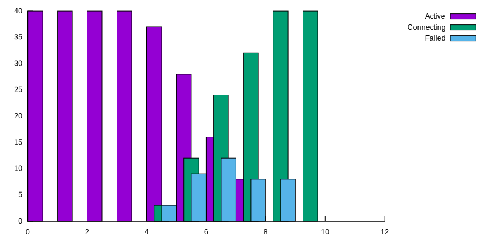
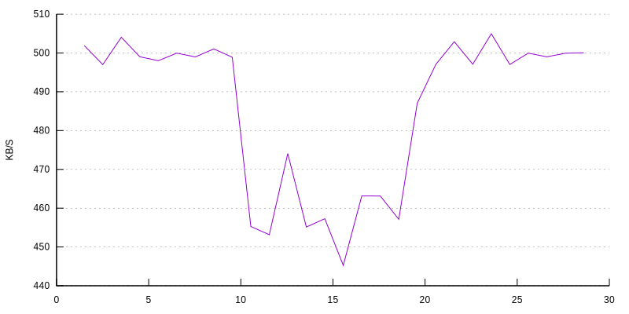

# Ctraffic - A continous-traffic test program

This program targets tests of disturbances for instance fail-over,
rolling upgrades and network problems. `Ctraffic` generates continuous
traffic over a period of time and monitors problems such as lost
connections, traffic disturbancies and retransmissions.

A ctraffic *server* is started, usually in a cluster behind some load
balancer for instance a [Kubernetes](https://kubernetes.io/)
service. Then ctraffic is started in *client* mode to generate traffic
on a number of connection. This command runs 100 KB/sec over a 1
minute period on 200 connections;

```
> ctraffic -timeout 1m -address [1000::1]:5003 -rate 100 -nconn 200 -monitor | jq .
Conn act/fail/connecting: 200/0/0, Packets send/rec/dropped: 86/86/0
Conn act/fail/connecting: 200/0/0, Packets send/rec/dropped: 194/194/0
Conn act/fail/connecting: 200/0/0, Packets send/rec/dropped: 286/286/0
...
Conn act/fail/connecting: 200/0/0, Packets send/rec/dropped: 5816/5816/0
Conn act/fail/connecting: 200/0/0, Packets send/rec/dropped: 5908/5908/0
{
  "Started": "2019-01-21T08:40:08.293474852Z",
  "Duration": 59993832043,
  "Rate": 100,
  "Connections": 200,
  "PacketSize": 1024,
  "FailedConnections": 0,
  "Sent": 5994,
  "Received": 5994,
  "Dropped": 0,
  "Retransmits": 0,
  "FailedConnects": 0
}
```

See also the `xcluster` [mconnect ovl](https://github.com/Nordix/xcluster/tree/master/ovl/ctraffic).

## Usage

Basic usage;
```
# Start the server;
ctraffic -server
# In another shell;
ctraffic -nconn 100 -monitor
```

In Kubernetes;
```
kubectl apply -f https://github.com/Nordix/ctraffic/raw/master/ctraffic.yaml
# Check the external ip;
kubectl get svc ctraffic
# On some external machine;
externalip=....      # from the printout above
ctraffic -timeout 1m -address $externalip:5003 -rate 100 -nconn 200 -monitor
```

## Analyze saved data

In automatic testing the statistics is saved for later analysis. In
the example below a local server is used and is killed around 5
seconds after the test is started;

```
# Start the server in a shell;
ctraffic -server
# In another shell start the client;
ctraffic -nconn 40 -rate 10 -stats all -monitor -timeout 12s > /tmp/data.json
# In the first shell, kill the server after ~5s;
^C
```

Analyze the saved data;

```
ctraffic -stat_file /tmp/data.json -analyze connections
Time Active New Failed Connecting
0.5 40 40 0 0
1.5 40 0 0 0
2.5 40 0 0 0
3.5 40 0 0 0
4.5 37 3 3 3
5.5 28 9 9 12
6.5 16 12 12 24
7.5 8 8 8 32
8.5 0 8 8 40
9.5 0 0 0 40
```

Normally `new` and `failed` are the same because failed connections
are immediately renewed. Since the server is stopped in this example
the new connections will go to `connecting`. The packets/second on
each connection is 10/40 which means one packet every 4'th second so
it takes ~4 sec for all connections to fail.

The data can be used to create a plot with `gnuplot`. Below is an
example how to do this maually;

```
ctraffic -stat_file /tmp/data.json -analyze connections > /tmp/data.data
gnuplot
# In gnuplot;
set yrange [0:48]
set xrange [0:10]
set key autotitle columnhead
set boxwidth 0.5 relative
set border 0
set style fill solid 0.5 border -1
plot '/tmp/data.data' using ($1-0.25):2 with boxes, '' using 1:5 with boxes, '' using ($1+0.25):4 with boxes
```

The `scripts/plot.sh` script described later can be used for greating graphs
automatically.


## Statistics

At the end of a test run statistics is printed to `stdout` in
(unformatted) `json` format. Pipe to `jq` to get formatted output.
The "monitor" printouts goes to `stderr` so they are visible and will
not interfere with the statistics output;

```
> ctraffic ... -monitor | jq .
...
{
  "Started": "2019-01-21T08:40:08.293474852Z",
  "Duration": 59993832043,
  "Rate": 100,
  "Connections": 200,
  "PacketSize": 1024,
  "FailedConnections": 0,
  "Sent": 5994,
  "Received": 5994,
  "Dropped": 0,
  "Retransmits": 0,
  "FailedConnects": 0
}
```

If sent and received packets packet counters differs packets have been
lost "in flight" when connections fails.

`Dropped` are packets deliberate dropped on the sending side because
of disturbancies such as network delays (caused by
packet-loss/retransmit).


If the interval between packets is larger than the re-transmit
interval, usually 200mS on Linux, no packet will be dropped on a
single packet-loss. If you want to see packet loss as dropped
packets (and reduced throughput) make sure the packet rate per
connection is higher than 5 packets/S.

If `--stats=all` is specified additional statistics for connections
and samples are included. This is necessary for post-test analysis.


## Graphs

The `scripts/plot.sh` script is a utility for creating graphs. Example;

```
scripts/plot.sh connections Active < /tmp/data.json > /tmp/conn.svg
```

with the data from the example above produces this graph;



Here is another example where packet-loss is introduced for some time
with;

```
iptables -A INPUT -i eth1 -m statistic --mode random --probability 0.05 -j DROP
```

Traffic at 500 KB/S is started towards a k8s cluster and the
statistics is saved;

```
ctraffic -timeout 30s -address 10.0.0.2:5003 -nconn 40 -rate 500 -stats=all > /tmp/packet-loss.json
```

The graph is produced with;

```
./scripts/plot.sh throughput < /tmp/packet-loss.json > /tmp/packet-loss.svg
```




## Build

```
go get github.com/brucespang/go-tcpinfo
go get golang.org/x/time/rate
go get -u github.com/Nordix/ctraffic
cd $GOPATH/src/github.com/Nordix/ctraffic
ver=$(git rev-parse --short HEAD)
#ver=$(date +%F:%T)
CGO_ENABLED=0 GOOS=linux go install -a \
  -ldflags "-extldflags '-static' -X main.version=$ver" \
  github.com/Nordix/ctraffic/cmd/ctraffic
strip $GOPATH/bin/ctraffic

# Build a docker image;
docker rmi docker.io/nordixorg/ctraffic:$ver
cd $GOPATH/bin
tar -cf - ctraffic | docker import \
  -c 'CMD ["/ctraffic", "-server", "-address", "[::]:5003"]' \
  - docker.io/nordixorg/ctraffic:$ver
```


## Problems

The `net.Conn` on the server side opens 3 file descriptors (1 socket +
2 pipes) so even though the "ulimit" is 1024 fd's only ~330 simultaneous
connections cen be served.
